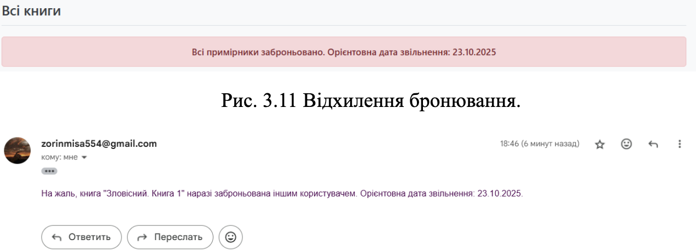

## Розділ 14. Визначення циклів у системі

У розробленій системі автоматизації бібліотеки виділено кілька типів циклів: життєві цикли об'єктів та замкнені контури керування.

### 14.1. Життєвий цикл примірника книги (`book_items`)
Це основний операційний цикл системи, що відображає рух активів:
1. **Надходження**: Створення запису в БД зі статусом `Available`.
2. **Видача**: Перехід у статус `Issued` при створенні запису в таблиці `loans`.
3. **Експлуатація**: Період перебування книги у читача (контролюється полем `due_date`).
4. **Повернення**: Оновлення статусу на `Available` та закриття запису в `loans`.
5. **Списання**: Видалення або зміна статусу на `Archived`.

### 14.2. Контур зворотного зв'язку (Overdue Loop)
Система реалізує циклічну перевірку заборгованостей:
* **Запит**: Функція `overdue-check` сканує таблицю `loans`.
* **Дія**: Якщо `current_date > due_date`, система маркує позику як протерміновану.
* **Результат**: Відображення в `Admin Dashboard` (через `Chart.js`), що спонукає бібліотекаря до адміністративного впливу.

### 14.3. Системні цикли зворотного зв'язку (Feedback Loops)

Згідно з принципами системного аналізу, інформаційна система бібліотеки функціонує як сукупність взаємопов'язаних контурів, що забезпечують її стабільність та розвиток.

#### 1. Балансуючий цикл (Balancing Loop) — Контроль заборгованостей
Цей цикл спрямований на підтримку системи у стані рівноваги шляхом стабілізації книжкового фонду:
* **Механізм**: Збільшення кількості протермінованих видач → Спрацювання алгоритму `overdue-check` → Автоматичне надсилання сповіщень через `NotificationService` → Повернення книг читачами.
* **Результат**: Зменшення заборгованості та повернення примірників у статус `Available`, що відновлює цілісність системи.

#### 2. Підсилюючий цикл (Reinforcing Loop) — Популярність та ріст системи
Цей цикл відображає позитивну динаміку розвитку сервісу:
* **Механізм**: Якісне наповнення електронного каталогу (Розділ 15) → Ріст кількості успішних бронювань користувачами → Збільшення активності в системі → Накопичення позитивної статистики в `Admin Dashboard` → Обґрунтування розширення фонду та інвестицій у систему.
* **Результат**: Постійне зростання цінності ІС для навчального закладу та користувачів.

> **Системний висновок**: Поєднання цих циклів дозволяє системі не лише виконувати поточні завдання обліку, а й адаптуватися до потреб користувачів, зберігаючи внутрішню стійкість.

```javascript
// Виконання циклу перевірки заборгованостей (overdue-check)
const handleCheckOverdue = () => {
  setIsLoading(true);
  api.post('/api/analytics/overdue-check')
    .then(res => {
      setMessage({ type: 'success', text: res.data.message });
      // Оновлення звітів після перевірки
      api.get('/api/analytics/overdue').then(res => setOverdue(res.data));
      api.get('/api/analytics/stats').then(res => setStats(res.data));
    })
    .catch(err => {
      setMessage({ type: 'error', text: 'Помилка виконання перевірки' });
    })
    .finally(() => setIsLoading(false));
};
```

* **Код автоматичного Email-сповіщення боржників з notificationService.js**:

```javascript
async sendDueReminder(email, bookTitle, dueDate) {
    const mailOptions = {
        from: 'zorinmisa554@gmail.com',
        to: email,
        subject: 'Нагадування про повернення книги',
        text: `Термін повернення книги "${bookTitle}" (дата: ${dueDate}) вже минув.`
    };
    await transporter.sendMail(mailOptions);
}
```


