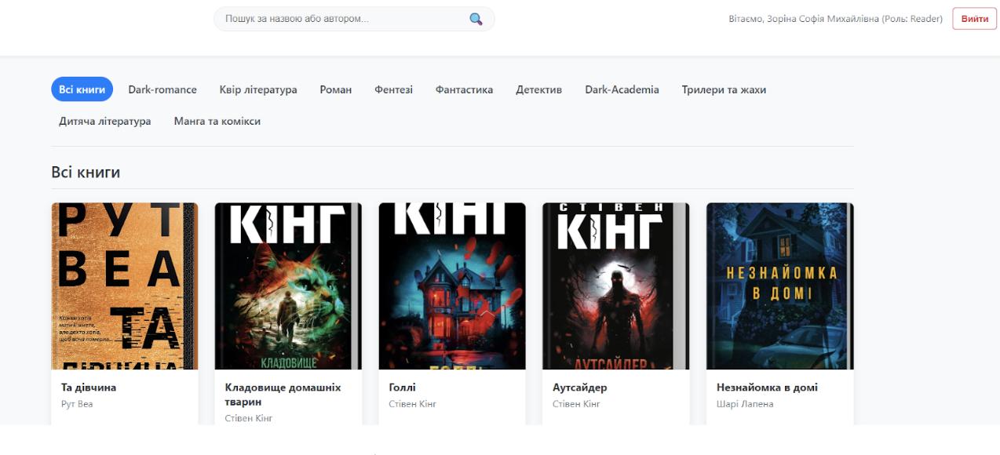

## Розділ 15. Визначення артефакту системи
Згідно з класифікаційною моделлю, наведеною в Лекції №3, кожна інформаційна система розглядається як складний артефакт, що має свою позицію в системі координат за типом даних та рівнем управління.

### 15.1. Класифікація за типом даних та управління
Відповідно до результатів моделювання, розроблена система автоматизації бібліотеки відповідає артефакту «Фактографічна інформаційна система управління» (Management Information System / MIS).

* **Фактографічність**: Система оперує чіткими фактами (даними про наявність конкретного примірника, дату видачі, ID користувача), що зберігаються в реляційній структурі SQL.

* **Цифровий двійник процесу**: Кожен запис у таблицях `books` та `book_items` точно відображає стан фізичної одиниці фонду, перетворюючи систему на актуальну модель реальної бібліотеки.

### 15.2. Відповідність технічним критеріям
Згідно з системними вимогами, цей артефакт характеризується наступним:

* **Структурність**: Система має жорстку схему даних (ER-діаграма), що забезпечує цілісність інформаційного поля.
* **Функціональність**: Наявність аналітичного модуля (`stats` та `analytics/overdue`) перетворює систему з простого сховища на інструмент підтримки прийняття рішень для адміністратора.

### 15.3. Програмна реалізація цілісності артефакту (AuthContext.js)
Код глобального стану робить систему цілісною, забезпечуючи єдину логіку перевірки прав доступу для всіх компонентів:

```javascript
export const AuthProvider = ({ children }) => {
    const [user, setUser] = useState(null);
    const navigate = useNavigate();

    const login = async (email, password) => {
        try {
            const response = await api.post('/auth/login', { email, password });
            const { token, role, name } = response.data;
            localStorage.setItem('token', token);
            setUser({ name, role });
            if (role === 'Administrator') navigate('/admin');
            else if (role === 'Librarian') navigate('/librarian');
            else navigate('/catalog');
        } catch (error) {
            console.error("Помилка логіну:", error);
            throw error;
        }
    }; 

    const logout = () => {
        localStorage.removeItem('token');
        setUser(null);
        navigate('/login');
    };

    return (
        <AuthContext.Provider value={{ user, login, logout }}>
            {children}
        </AuthContext.Provider>
    );
};
```

