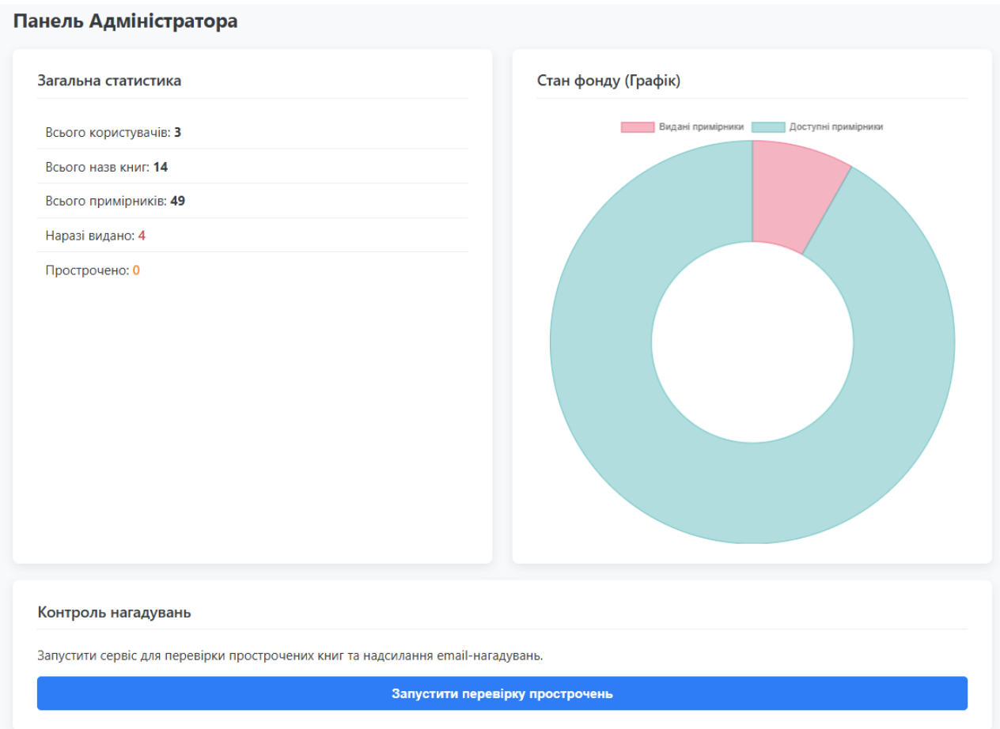
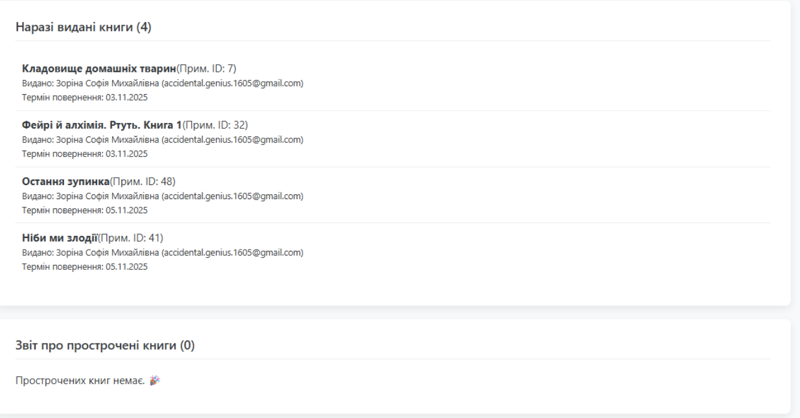

## Розділ 16. Точки впливу на систему
Згідно з системним підходом (Лекція №2), точки впливу — це критичні вузли в структурі системи, де незначні зміни параметрів можуть призвести до значних зрушень у стані всієї структури.

### 16.1. Вхідні точки впливу (Керування та Правила)
Ці точки дозволяють змінювати поведінку системи без переписування її архітектури:
* **Контур авторизації та ролей**: Централізована логіка в `AuthContext.js` є точкою впливу на безпеку. Зміна одного параметру (наприклад, терміну дії JWT-токена) миттєво змінює рівень захищеності всіх підсистем.
* **Бізнес-правила термінів (due_date)**: Конфігурація терміну видачі книг у коді є «важелем», що регулює швидкість обігу книжкового фонду. Зміна цього правила впливає на частоту спрацювання циклу `overdue-check`.

### 16.2. Технічні точки впливу (Продуктивність та Стійкість)
Вплив на інфраструктурному рівні для забезпечення стабільності:
* **Пул з'єднань (`pg-pool`)**: Налаштування в `db.js` є точкою впливу на пропускну здатність системи. Оптимізація кількості одночасних з'єднань дозволяє системі витримувати пікові навантаження під час масової перереєстрації читачів.
* **Індексація бази даних**: Впровадження індексів на ключові поля (`isbn`, `user_id`) — це точка впливу на швидкість зворотного зв'язку. Це критично для формування аналітичних звітів у реальному часі.

### 16.3. Інформаційні точки впливу (Аналітика та Зворотний зв'язок)
Найвищий рівень впливу — зміна інформаційних потоків:
* **Візуалізація в AdminDashboard.js**: Графіки статистики є головним інструментом впливу адміністратора. Бачачи реальний стан фонду, він може оперативно змінювати стратегію закупівель або адміністрування.

* **Логіка графіка AdminDashboard.js, як головний інструмент впливу адміна**:

```javascript
const chartData = {
    labels: ['Видані', 'Доступні'],
    datasets: [{
        data: [stats ? stats.issuedCopies : 0, stats ? (stats.totalCopies - stats.issuedCopies) : 0],
        backgroundColor: ['rgba(255, 99, 132, 0.5)', 'rgba(75, 192, 192, 0.5)']
    }]
};
```
> **Висновок**: Ідентифікація цих точок дозволяє перетворити «купу коду» на керовану систему, де кожен технічний параметр працює на досягнення загальної мети — ефективного управління бібліотечним фондом.


