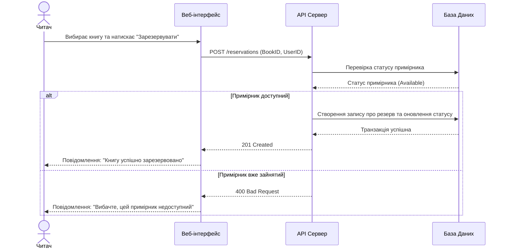

## Розділ 5. Відображення User Stories у UML-нотації

У цьому розділі представлено діаграми послідовності (Sequence Diagrams) для двох ключових сценаріїв взаємодії користувача із системою.

### 5.1. Діаграма послідовності: Резервування книги Читачем

Цей сценарій демонструє процес онлайн-бронювання книги через веб-інтерфейс.


### 5.2. Діаграма послідовності: Видача книги Бібліотекарем

Цей сценарій описує робочий процес бібліотекаря при видачі книги користувачу та реєстрацію події в системі.

```mermaid
sequenceDiagram
    actor Librarian as Бібліотекар
    participant API as API Сервер
    participant DB as База Даних
    participant Notification as NotificationService

    Librarian->>API: POST /loans (ReaderID, BookID)
    API->>DB: Зміна статусу примірника на "Issued"
    API->>DB: Створення запису в таблиці обігу (due_date)
    DB-->>API: Транзакція успішна
    
    par Асинхронне сповіщення
        API->>Notification: Надіслати email-підтвердження Читачу
        Notification-->>API: Статус доставки (OK)
    end

    API-->>Librarian: Підтвердження: Видача зафіксована  
    
