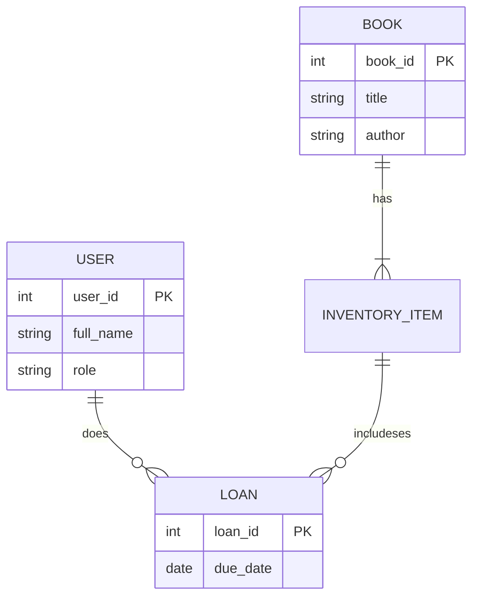

## Розділ 7. Побудова моделі даних

**7.1. Основні сутності та атрибути**
* **Users**: `user_id` (PK), `full_name`, `email`, `role`.
* **Books**: `book_id` (PK), `title`, `author`, `isbn`.
* **Inventory_Items**: `item_id` (PK), `book_id` (FK), `status` (Available, Reserved, Issued).
* **Loans**: `loan_id` (PK), `user_id` (FK), `item_id` (FK), `issue_date`, `due_date`.

**7.2. ER-діаграма**



```sql
-- Реальна схема БД з курсової роботи
CREATE TABLE books (
  id SERIAL PRIMARY KEY,
  title VARCHAR(255) NOT NULL,
  author VARCHAR(255),
  isbn VARCHAR(20) UNIQUE,
  category VARCHAR(100)
);

CREATE TABLE book_items (
  id SERIAL PRIMARY KEY,
  book_id INTEGER REFERENCES books(id),
  inventory_number VARCHAR(50) UNIQUE,
  status VARCHAR(20) DEFAULT 'Available' -- Available, Issued, Reserved
);

CREATE TABLE loans (
  id SERIAL PRIMARY KEY,
  user_id INTEGER REFERENCES users(id),
  item_id INTEGER REFERENCES book_items(id),
  issue_date DATE DEFAULT CURRENT_DATE,
  due_date DATE,
  return_date DATE
);
```

```javascript
// User.js
module.exports = (sequelize, DataTypes) => {
    return sequelize.define('User', {
        user_id: { type: DataTypes.INTEGER, primaryKey: true, autoIncrement: true },
        pib: { type: DataTypes.STRING, allowNull: false },
        email: { type: DataTypes.STRING, unique: true, allowNull: false },
        password_hash: { type: DataTypes.STRING, allowNull: false },
        role: { type: DataTypes.STRING, defaultValue: 'Reader' }
    }, { timestamps: false });
};
```


