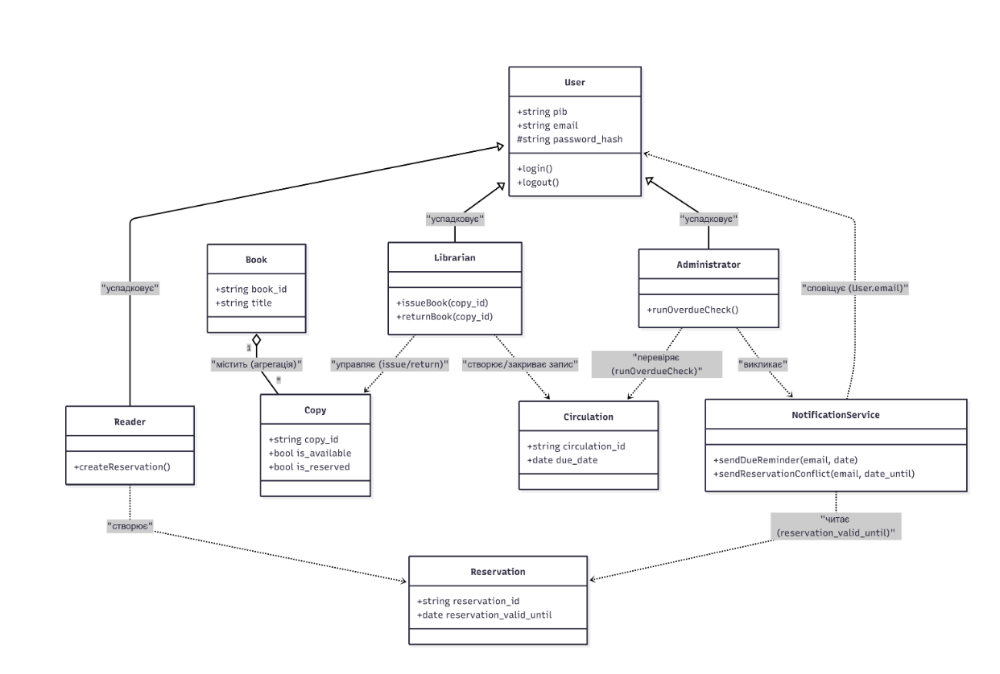

# 📚 Система автоматизації бібліотечної діяльності

**Курсовий проєкт** з дисципліни "Системний аналіз та проєктування".  

---

## 📂 Повна структура пояснювальної записки

Нижче наведено навігацію по всіх 16 розділах проєкту, що зберігаються в папці `/Project`:

| № | Розділ | Ключовий зміст |
| :--- | :--- | :--- |
| 1 | [Вступ](./Project/Section_1.md) | Мета та актуальність автоматизації бібліотеки. |
| 2 | [Стек технологій](./Project/Section_2.md) | Налаштування `.env`, Node.js, React та PostgreSQL. |
| 3 | [Об'єкт аналізу](./Project/Section_3.md) | Опис структури бібліотечного фонду та процесів. |
| 4 | [Проблематика](./Project/Section_4.md) | Аналіз недоліків паперового обліку книг. |
| 5 | [Вимоги до системи](./Project/Section_5.md) | Функціональні та технічні вимоги до ПЗ. |
| 6 | [Архітектура](./Project/Section_6.md) | **Діаграма компонентів та server.js**. |
| 7 | [Модель даних](./Project/Section_7.md) | **SQL-схема та ER-діаграма (PostgreSQL)**. |
| 8 | [Вибір СКБД](./Project/Section_8.md) | Обґрунтування PostgreSQL та логіка зв'язків. |
| 9 | [Алгоритми](./Project/Section_9.md) | Логіка обробки видач та повернення книг. |
| 10 | [Безпека](./Project/Section_10.md) | **Захист паролів (bcrypt) та JWT-авторизація**. |
| 11 | [Тестування](./Project/Section_11.md) | План мануального тестування (Manual QA). |
| 12 | [Керівництво](./Project/Section_12.md) | Інструкції для бібліотекаря та адміністратора. |
| 13 | [Результати](./Project/Section_13.md) | **Інтерфейс видачі книг (UI)**. |
| 14 | [Життєві цикли](./Project/Section_14.md) | **Email-сповіщення та статус бронювання**. |
| 15 | [Артефакт](./Project/Section_15.md) | **Теоретичне визначення та цілісність системи**. |
| 16 | [Точки впливу](./Project/Section_16.md) | **Адмін-панель та статистика (Analytics)**. |
| 17 | [Висновок](./Project/Section_17_conclusion.md) | **Перспективи розвитку та системний підсумок**. |

---

## 🛠 Технічні особливості
* **Трирівнева архітектура**: Чітке розділення Frontend, Backend та Database.
* **Автоматизація**: Система самостійно надсилає Email при затримці повернення книг.
* **Аналітика**: Візуалізація стану фонду через графіки в кабінеті адміна.

---

## 🚀 Візуалізація архітектури системи

Нижче наведено UML-діаграму класів, яка відображає логіку взаємодії користувачів, сервісів сповіщень та об'єктів фонду:

### Ключові вузли архітектури:
* **User & Roles**: Система розмежовує права для Читача, Бібліотекаря та Адміністратора.
* **Business Logic**: Класи `Librarian` та `Administrator` керують процесами видачі (`issueBook`) та перевірки прострочень (`runOverdueCheck`).
* **Services**: `NotificationService` автоматизує комунікацію з користувачами через Email.

## 💻 Технічна реалізація (Code Snippets)
У відповідних розділах наведено ключові фрагменти програмного коду, що демонструють логіку роботи системи:
* **Backend**: Приклад точки входу `server.js` та логіка підключення до БД.
* **Database**: SQL-запити для створення структури таблиць.
* **Security**: Приклади використання бібліотек `bcryptjs` та `jsonwebtoken` для захисту даних.
* **ORM**: Налаштування зв'язків між сутностями (Book, Copy, User) через Sequelize.

> **Примітка:** У репозиторії представлені архітектурні рішення та фрагменти коду для демонстрації проектування системи. Повна програмна реалізація є частиною внутрішнього розробницького середовища.

---

## 📈 Результати проектування
Візуалізація інтерфейсів та логіки (скриншоти та діаграми) доступна у розділах:
* [Розділ 13](./Project/Section_13.md) — Панель видачі книг бібліотекарем.
* [Розділ 15](./Project/Section_15.md) — Інтерфейс каталогу для читачів.
* [Розділ 16](./Project/Section_16.md) — Модуль аналітики та звітів адміністратора.
